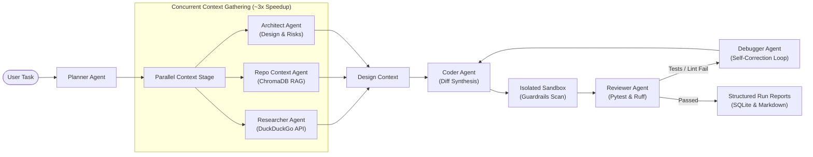

# 🐝 Swarnyam AI Agent

<p align="center">
  
  
  
  
  
</p>

<p align="center">
  <strong>Swarnyam: Autonomous Multi-Agent AI Coding Swarm with Parallel Context, Tree-Sitter RAG, Guardrailed Sandboxes, Self-Correcting Debugging, and Offline Fallback.</strong>
</p>

---

## 📌 Overview

**Swarnyam AI Agent** is an autonomous, multi-agent software engineering system that autonomously plans, researches, writes, tests, and self-corrects code across target repositories. Rather than relying on a brittle, monolithic prompt, Swarnyam decomposes complex engineering workflows into a pipeline of specialized, cooperating agents.



---

## ✨ Key Features

| Capability | Description |
|---|---|
| **⚡ Parallel Context Gathering** | Executes Researcher, Repo Context, and Architect concurrently via thread-pool fanout for a **~3x reduction in research latency**. |
| **🌲 Tree-Sitter AST & ChromaDB RAG** | Syntactically chunks codebases with tree-sitter AST parsing and stores dense semantic vectors using local SentenceTransformers (CPU-only). |
| **🛡️ Guardrailed Sandbox Execution** | Enforces static security checks (blocking `os.system`, `eval`, arbitrary shells) and tests changes strictly inside isolated runtime sandboxes. |
| **🔄 Self-Correcting Review Loop** | Automatically runs `pytest` and `ruff` on generated diffs. If tests fail, the **Debugger Agent** analyzes root causes and iterates up to 3 times. |
| **🔀 3-Tier Multi-LLM Cascade** | Resilient fallback chain: **Groq** (`gpt-oss-120b`) &rarr; **OpenRouter free tier** &rarr; **Local llama.cpp** (`qwen2.5-coder-1.5b.gguf`) for air-gapped / offline execution. |
| **📊 Auditable Observability** | Automatic logging of every prompt, response, latency, token spend, and cost in SQLite, paired with rich Markdown reports (`outputs/run-<id>.md`). |
| **🐳 Containerized Portability** | Production-ready Docker and Docker Compose environments with isolated sandbox volumes and read-only model mounts. |

---

## 🚀 Quickstart

### Prerequisites
- Python 3.10 or higher (or Docker)
- Git

### 1. Clone & Set Up Environment

```bash
# Clone the repository
git clone https://github.com/Nikhil-X-codes/Swarnyam-AI-Agent.git
cd Swarnyam-AI-Agent

# Create and activate virtual environment
python -m venv .venv
# On Windows:
.venv\Scripts\activate
# On Linux/macOS:
source .venv/bin/activate

# Install dependencies
pip install -r requirements.txt
```

### 2. Configure Credentials

Copy `.env.example` to `.env` and add your LLM API keys:

```bash
cp .env.example .env
```

```ini
GROQ_API_KEY=gsk_your_groq_api_key
GROQ_MODEL=openai/gpt-oss-120b
OPENROUTER_API_KEY=sk-or-your_openrouter_key  # Optional fallback
```

---

## 💻 CLI Usage

All capabilities are unified under `python main.py` CLI:

### 1. Plan a Task
Generate a structured engineering implementation plan and acceptance criteria:
```bash
python main.py plan "Add an exponential backoff retry helper function"
```

### 2. Index a Target Repository (RAG)
Parse and index the repository into ChromaDB vector database:
```bash
python main.py index --repo workspace/sample-calc
```

### 3. Solve a Task End-to-End
Run the entire swarm pipeline (Plan &rarr; Context Fan-out &rarr; Code &rarr; Review &rarr; Debug):
```bash
python main.py solve "Add a clean_url function that removes marketing tracking query params" --repo workspace/text-utils
```

### 4. Run Benchmark Evals
Benchmark the swarm across test cases:
```bash
python main.py eval --suite eval/tasks/
```

### 5. Inspect Cost & Run History
Review audit logs and token expenditure:
```bash
# View the latest run's execution metrics and status
python main.py last-run

# View aggregate cost breakdown across LLM providers
python main.py cost-report
```

---

## 🐳 Docker Deployment

Run the entire swarm without installing Python or dependencies on the host system:

### Build Container
```bash
docker build -t swarm-agent:latest .
```

### Run Tasks in Container
```powershell
docker run --rm --env-file .env `
  -v "${PWD}/workspace/target-repo:/workspace/target-repo" `
  -v "${PWD}/models:/app/models:ro" `
  -v "${PWD}/outputs:/app/outputs" `
  swarm-agent solve "Refactor database connection pool" --repo /workspace/target-repo
```

Or with Docker Compose:
```bash
docker compose run --rm swarm-agent solve "Your task here" --repo /workspace/target-repo
```

---

## 📚 Documentation Index

Comprehensive documentation is available in the [`docs/`](docs/) directory:

| Document | Description |
|---|---|
| 📖 [**CLI Reference**](docs/cli-reference.md) | Full command-line synopsis, options, exit codes, and JSON schema outputs. |
| 🐳 [**Docker Guide**](docs/docker.md) | In-depth container configuration, volume topologies, and Docker Compose workflows. |
| ⚙️ [**Configuration Reference**](docs/config.md) | Exhaustive index of all environment variables, fallback thresholds, and model settings. |
| 🌐 [**Documentation Portal (`index.md`)**](docs/index.md) | MkDocs root overview and site navigation setup. |

### 🏗️ Phase-by-Phase Architecture Deep Dives

| Architecture Specification | Phase Coverage |
|---|---|
| [**Phase 1 Architecture**](docs/phase_1_architecture.md) | System Foundation, Groq Client, and Fallback Strategy |
| [**Phase 2 Architecture**](docs/phase_2_architecture.md) | Planner Agent, Pydantic Schema, and Plan Generation |
| [**Phase 3 Architecture**](docs/phase_3_architecture.md) | Tree-Sitter AST Code Chunking & ChromaDB RAG Pipeline |
| [**Phase 4 & 4.5 Architecture**](docs/phase_4_and_4_5_architecture.md) | Coder Agent, Unified Diffs, Sandbox Isolation, and Eval Benchmark Suite |
| [**Phase 5 Architecture**](docs/phase_5_architecture.md) | Reviewer Agent (Pytest + Ruff) & Debugger Self-Correction Loop |
| [**Phase 6 Architecture**](docs/phase_6_architecture.md) | Researcher (DuckDuckGo), Repo Context, and Architect Agents |
| [**Phase 7 Architecture**](docs/phase_7_architecture.md) | Concurrent Fan-out, Thread-Pool Optimization, and Design Context Merging |
| [**Phase 8 Architecture**](docs/phase_8_architecture.md) | SQLite Observability, Cost Tracking, and Structured Markdown Run Reports |
| [**Phase 9 Architecture**](docs/phase_9_architecture.md) | Docker Containerization, Volume Decoupling, and Multi-Stage Builds |

---

## 📁 Repository Structure

```
agent-swarm/
├── agents/             # Autonomous agent implementations (Planner, Coder, Reviewer, Debugger, etc.)
├── execution/          # Sandbox workspace isolation, unified diff application, guardrail scans
├── rag/                # Tree-sitter AST parser, chunking, and ChromaDB vector retrieval
├── tools/              # LLM client cascade (Groq / OpenRouter / llama.cpp) and web tools
├── memory/             # SQLite logging database, audit trails, and run report generator
├── models/             # Local GGUF models config for offline fallback
├── eval/               # Benchmark test suite and evaluation harness
├── workspace/          # Target repositories for testing and indexing
├── outputs/            # Generated Markdown run audit reports
├── docs/               # System documentation and architecture phase guides
├── Dockerfile          # Multi-stage production container build
├── docker-compose.yml  # Container orchestration specification
├── main.py             # Single entrypoint CLI (Click)
└── requirements.txt    # Project dependencies
```

---

## 🛡️ Safety & Guardrails

**Swarnyam** implements strict security boundaries and policies to protect your host system and codebase:
1. **Isolated Sandboxing**: Diffs are never directly applied to your source repository. Execution occurs in an isolated sandbox clone.
2. **Static AST Guardrail Scan**: Diffs containing unauthorized calls (`eval`, `exec`, `os.system`, `subprocess(shell=True)`) are automatically rejected.
3. **Loop Capping**: All self-correction iterations are strictly capped at 3 attempts to prevent runaway API spending.
4. **Air-Gapped Operation**: Run 100% offline via local GGUF models without external network access when desired.

---

## 📄 License

This project is licensed under the MIT License - see the LICENSE file for details.
