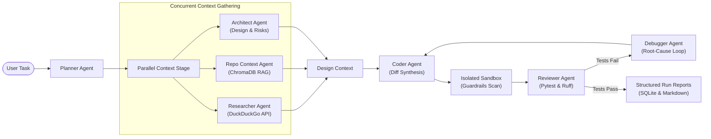

# Swarnyam AI Agent

<p align="center">
  <strong>Swarnyam: Autonomous Multi-Agent AI Coding Swarm with Parallel Context, RAG, Self-Correction, and Offline LLM Fallback.</strong>
</p>

---

## What is Swarnyam?

**Swarnyam** is an autonomous multi-agent coding framework designed to plan, research, design, code, review, and debug software repositories autonomously. Rather than relying on a single monolithic prompt, Swarnyam decomposes complex software engineering tasks into specialized, collaborating agents running concurrently.



---

## Key Features

=== "Parallel Context Gathering"
    Runs **Researcher**, **Repo Context**, and **Architect** concurrently using a thread-pool fan-out. Gathers web documentation, vector search chunks, and architectural boundaries with a **~3x speedup** over sequential execution.

=== "AST Chunking & ChromaDB RAG"
    Parses codebases using **Tree-Sitter** grammar syntax trees and generates dense embeddings via **SentenceTransformers**, indexing semantic chunks for contextual code retrieval.

=== "Coder & Self-Correction Loop"
    Deterministic unified diff synthesis with automated **Guardrail scanning** (blocks `os.system`, `eval`, arbitrary shell executions). Tests execute inside sandboxes with automated pytest/ruff review and a 3-attempt Debugger remediation loop.

=== "Multi-Tier LLM Fallback"
    Graceful 3-tier cascade: **Groq** (`gpt-oss-120b`) &rarr; **OpenRouter free tier** &rarr; **Local llama.cpp** (`qwen2.5-coder-1.5b.gguf`). Allows air-gapped execution via `--offline`.

=== "Auditable SQLite Observability"
    Every prompt, response, latency, token spend, and backend is logged automatically to SQLite. Auto-generates standalone Markdown run summaries (`outputs/run-<id>.md`).

=== "Docker Containerization"
    Self-contained portable execution with decoupled volume mounts for target repositories, read-only GGUF weights, and container-internal sandbox workspaces.

---

## Quickstart in 60 Seconds

### 1. Installation

```bash
# Clone the repository
git clone https://github.com/Nikhil-X-codes/Swarnyam-AI-Agent.git
cd Swarnyam-AI-Agent

# Set up Python virtual environment
python -m venv .venv
source .venv/bin/activate  # On Windows: .venv\Scripts\activate

# Install dependencies
pip install -r requirements.txt
```

### 2. Configure Environment

Copy the example configuration and insert your API keys:

```bash
cp .env.example .env
```

```ini
GROQ_API_KEY=gsk_your_groq_key_here
GROQ_MODEL=openai/gpt-oss-120b
```

### 3. Plan a Task

```bash
python main.py plan "Add an exponential backoff retry helper"
```

### 4. Solve a Repository Task End-to-End

```bash
python main.py solve "Add a clean_url function that removes tracking params" --repo workspace/sample-calc
```

### 5. Inspect the Trace and Spend

```bash
python main.py last-run
python main.py cost-report
```

---

## Documentation Roadmap

* [**CLI Reference**](cli-reference.md): Detailed synopsis, arguments, options, and JSON outputs for all CLI commands.
* [**Docker Guide**](docker.md): How to containerize, mount volumes, and run tasks with Docker and Docker Compose.
* [**Configuration Reference**](config.md): Complete index of all supported environment variables.
* [**Architecture Deep Dives**](phase_1_architecture.md): Detailed phase-by-phase specifications from Phase 1 through Phase 9.
