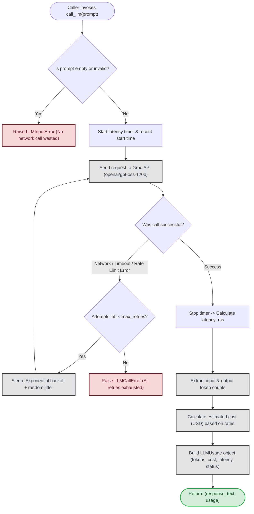
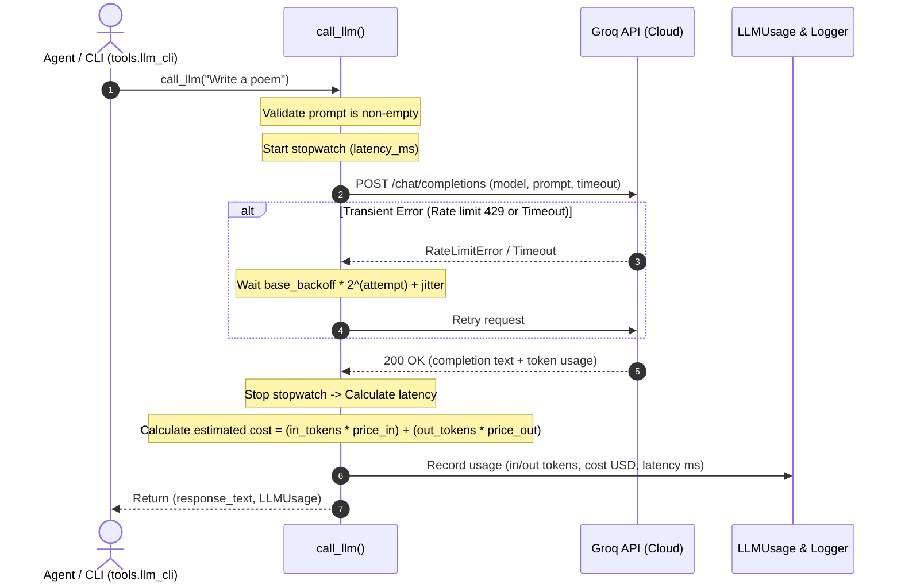

# Phase 1: LLM Connection Layer & Cost Tracking

This document explains the architecture and flow of **Phase 1** in simple, plain language.

---

## What Does Phase 1 Do?

Phase 1 provides a single, rock-solid gateway function called `call_llm()`. Every agent in the swarm (Planner, Researcher, Coder, etc.) uses this one function to communicate with the LLM. 

Instead of calling the AI provider directly, `call_llm()` acts like a smart middleman that:
1. **Validates input:** Rejects empty or invalid prompts immediately.
2. **Handles glitches automatically:** If there is a rate limit or timeout, it waits with exponential backoff and jitter, then retries.
3. **Tracks costs & latency:** Accurately measures token counts, estimated dollar cost, and response time in milliseconds for every single call.

---

## Flowchart: How `call_llm()` Works

---

## Sequence Diagram: Step-by-Step Interaction

---

## Core Components Breakdown

| Component | What It Does | Why It Matters |
|---|---|---|
| **Input Validation** | Checks `prompt.strip()` | Prevents wasting API credits or failing silently on empty requests. |
| **Groq API Client** | Uses `openai/gpt-oss-120b` | Provides fast, hosted cloud inference without requiring local GPU hardware. |
| **Exponential Backoff + Jitter** | Exponential delay with random randomness | Prevents hammering the API when transient rate limits or network blips occur. |
| **`LLMUsage` Dataclass** | Holds tokens, cost, latency, status | Gives observability from Day 1, feeding directly into later reporting and logging phases. |
