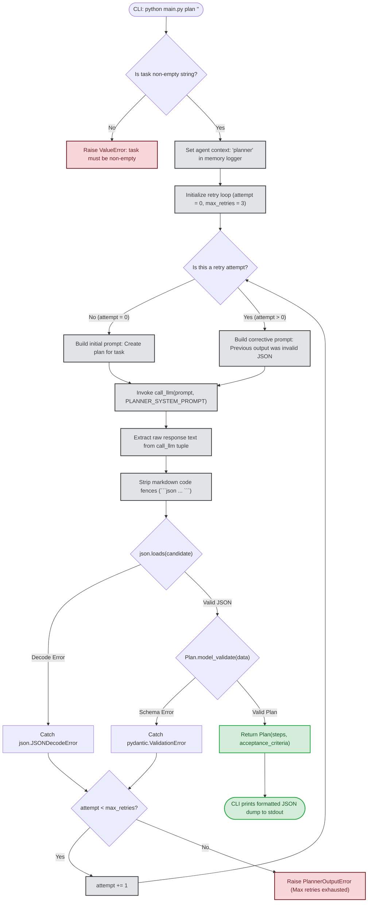
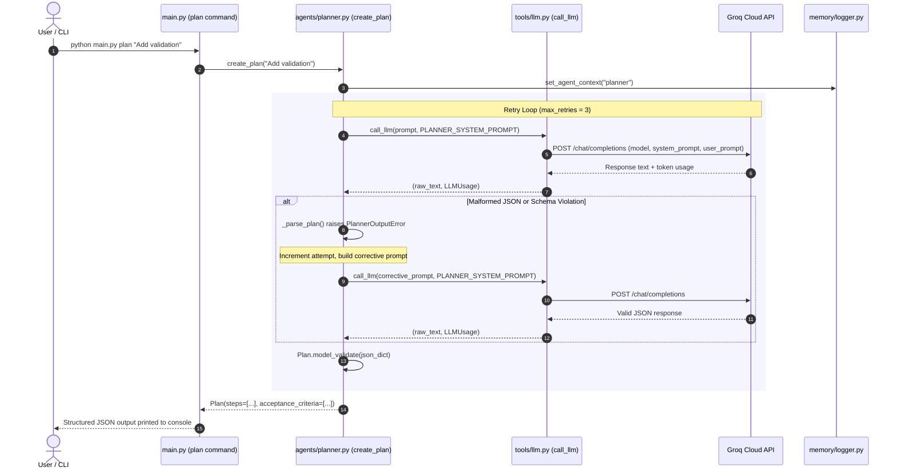

# Phase 2: Single Agent, No RAG Yet (Planner Agent)

This document explains the architecture and flow of **Phase 2** in simple, plain language.

---

## What Does Phase 2 Do?

Phase 2 builds the simplest possible working agent in the swarm: the **Planner Agent**.
The objective is to validate the prompt -> structured output pattern before adding downstream complexity (like RAG, coding, and review loops).

The Planner agent:
1. **Takes a task description:** Accepts a plain-text coding task from the user or CLI (`python main.py plan "<task>"`).
2. **Enforces a strict output contract:** Uses Pydantic (`Plan`) to guarantee the output is formatted as valid JSON containing concrete `steps` and `acceptance_criteria`.
3. **Implements error recovery:** If the model returns malformed JSON or invalid types, it automatically re-prompts the model with corrective guidance in a capped retry loop (`max_retries=3`).
4. **Interfaces with Phase 1:** Calls `call_llm()` for robust API execution, timeout/backoff handling, and cost/token tracking.

---

## Flowchart: How the Planner Agent Works

---

## Sequence Diagram: Step-by-Step Interaction

---

## Core Components Breakdown

| Component | Location | What It Does | Why It Matters |
|---|---|---|---|
| **`Plan` Pydantic Model** | [agents/planner.py](file:///d:/Projects/Swarm%20Agent/agents/planner.py) | Defines `steps: list[str]` and `acceptance_criteria: list[str]` with `min_length=1`. | Enforces strong schema guarantees for downstream agents (Architect, Coder). |
| **`PLANNER_SYSTEM_PROMPT`** | [agents/planner.py](file:///d:/Projects/Swarm%20Agent/agents/planner.py) | Instructs the model to output raw JSON adhering to the exact schema. | Keeps prompts localized with agent logic (rule from AGENTS.md). |
| **`_parse_plan()`** | [agents/planner.py](file:///d:/Projects/Swarm%20Agent/agents/planner.py) | Strips Markdown code blocks and invokes Pydantic validator. | Tolerates common LLM markdown formatting while enforcing valid JSON. |
| **`create_plan()`** | [agents/planner.py](file:///d:/Projects/Swarm%20Agent/agents/planner.py) | Executes the bounded retry loop on malformed outputs. | Guarantees reliability without open-ended loops (`while True` prohibited). |
| **CLI `plan` Subcommand** | [main.py](file:///d:/Projects/Swarm%20Agent/main.py) | Entry point CLI command (`python main.py plan "<task>"`). | Provides single developer interface for running the planner. |
| **Test Suite** | [tests/test_phase2.py](file:///d:/Projects/Swarm%20Agent/tests/test_phase2.py) | Unit tests with mock LLM for parsing, retries, and bounded failures. | Validates Phase 2 correctness and prevents regression. |
