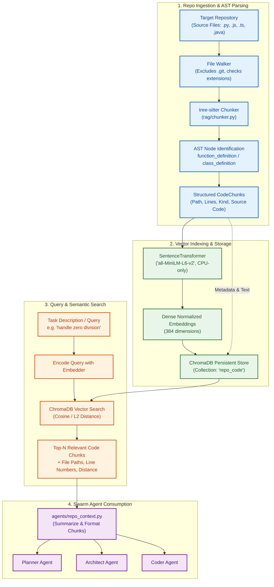
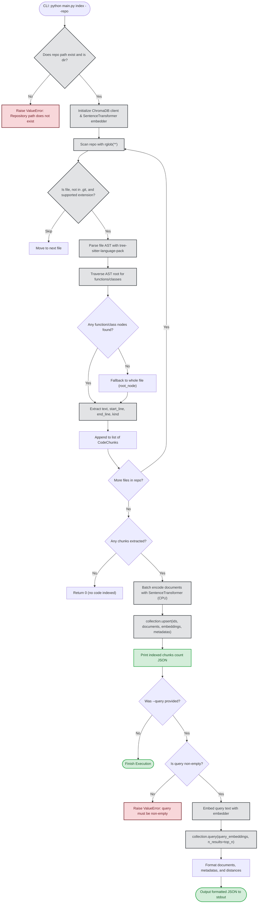
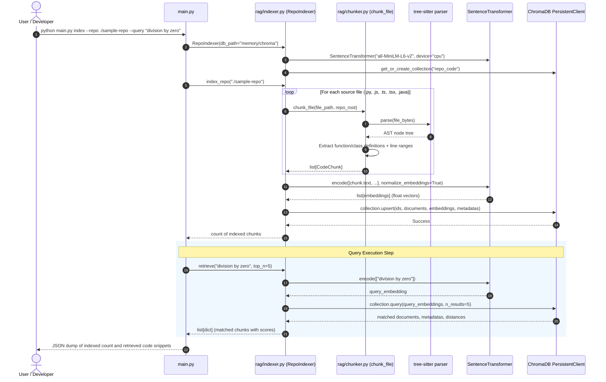

# Phase 3: RAG Pipeline (Repo Understanding)

This document explains the architecture, flow, and component design of **Phase 3** in simple, plain language.

---

## What Does Phase 3 Do?

Phase 3 gives the multi-agent swarm the ability to **intelligently "read" and understand a target codebase** before making plans or writing code.

Instead of stuffing an entire repository into the LLM context window (which blows token limits, inflates costs, and introduces hallucinations), Phase 3 implements a local, semantic **Retrieval-Augmented Generation (RAG)** pipeline:

1. **AST-Aware Code Chunking:** Uses `tree-sitter` (via `tree-sitter-language-pack`) to parse source files into Abstract Syntax Trees (AST). Rather than slicing code at arbitrary character or line counts, it extracts complete functions, classes, and method definitions across multiple programming languages (Python, JavaScript, TypeScript, TSX, Java).
2. **Local CPU Embedding Generation:** Converts each code chunk into normalized dense vector embeddings using `sentence-transformers` (`all-MiniLM-L6-v2`). Runs strictly on CPU without any GPU dependencies.
3. **ChromaDB Vector Storage:** Stores code chunks, line numbers, file paths, AST node kinds, and dense vectors in a persistent ChromaDB collection (`repo_code`).
4. **Semantic Retrieval:** Given a natural language task description (e.g. *"handle division by zero in calculator"*), retrieves the top-$N$ most relevant code chunks ranked by cosine similarity.
5. **CLI Interface:** Provides `python main.py index --repo <path> [--db <path>] [--query <text>]` to index repos and test query retrieval.
6. **Benchmark Task Candidates:** Starts drafting candidate coding tasks in `eval/phase3_candidates.md` to feed the benchmark suite in Phase 4.5.

---

## Architecture Diagram



---

## Detailed Process Flowchart



---

## Sequence Diagram: Indexing and Retrieval Lifecycle



---

## Key Components and Contracts

### 1. `CodeChunk` Data Structure ([rag/chunker.py](file:///d:/Projects/Swarm%20Agent/rag/chunker.py))

```python
@dataclass(frozen=True)
class CodeChunk:
    chunk_id: str      # E.g. "calc.py:10-25"
    path: str          # Relative file path inside repo
    language: str      # python, javascript, typescript, java
    kind: str          # function_definition, class_definition, etc.
    start_line: int    # 1-indexed start line
    end_line: int      # 1-indexed end line
    text: str          # Source code snippet
```

### 2. Supported Languages & Node Types

| Language | File Extensions | Tree-Sitter Node Types Captured |
|---|---|---|
| **Python** | `.py` | `function_definition`, `class_definition` |
| **JavaScript** | `.js` | `function_declaration`, `class_declaration`, `method_definition` |
| **TypeScript / TSX**| `.ts`, `.tsx` | `function_declaration`, `class_declaration`, `method_definition` |
| **Java** | `.java` | `method_declaration`, `class_declaration` |

*Fallback:* If a file contains top-level procedural code without functions or classes, the entire root node is preserved as a single chunk rather than being dropped.

### 3. `RepoIndexer` API ([rag/indexer.py](file:///d:/Projects/Swarm%20Agent/rag/indexer.py))

* **`index_repo(repo_path: str | Path) -> int`**:
  * Traverses all supported files in `repo_path`.
  * Computes embeddings and upserts into ChromaDB.
  * Returns total chunks indexed.
* **`retrieve(query: str, top_n: int = 5) -> list[dict]`**:
  * Validates non-empty query.
  * Performs vector cosine nearest-neighbor search.
  * Returns list of dictionaries containing `text`, `metadata`, and `distance`.

---

## How to Run & Verify

### Run the CLI Indexer
```bash
# Index a target repository and query it
python main.py index --repo ./sample-repo --query "divide by zero validation"
```

### Run Phase 3 Automated Tests
```bash
# Execute Phase 3 unit tests
.venv\Scripts\python -m pytest tests/test_phase3.py -v
```

### Success Check Criteria
- Ingest a known repository.
- Execute 3 distinct natural language task queries.
- In each case, verify that the top retrieved chunk corresponds to the exact module/function responsible for that task.
