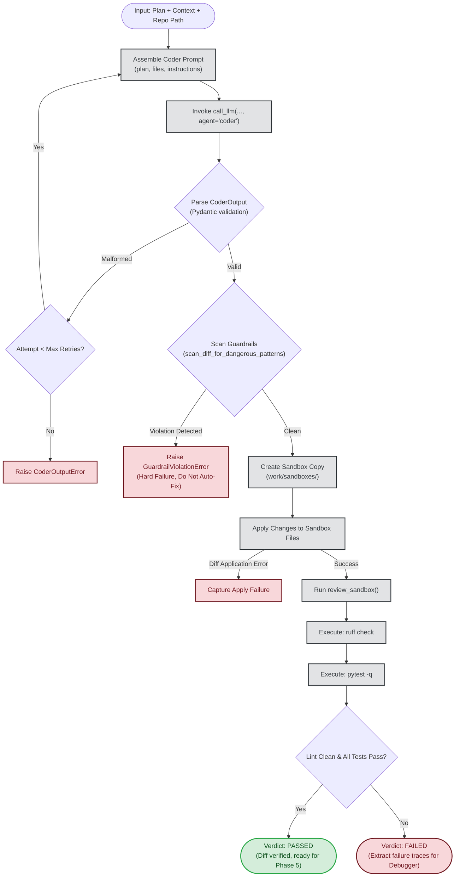
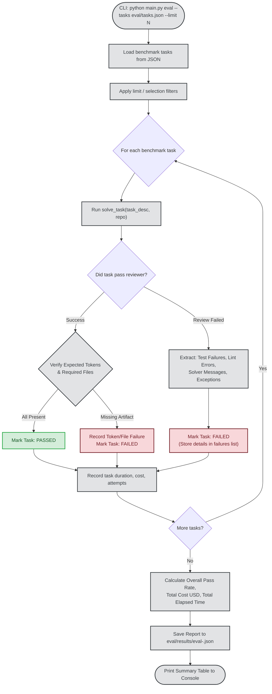

# Phase 4 & Phase 4.5: Coder-Reviewer Loop, Safety Guardrails & Eval Harness

This document provides a comprehensive architectural and operational breakdown of **Phase 4** and **Phase 4.5** of the multi-agent AI coding swarm.

---

## Executive Summary

- **Phase 4 (Coder + Reviewer Loop with Guardrails):** The execution engine of the swarm. It takes a plan and context, synthesizes unified code modifications, subjects every diff to strict security guardrail scans, applies safe modifications to an isolated sandboxed workspace copy, and runs automated testing and linting to generate structured pass/fail verdicts.
- **Phase 4.5 (Eval Harness & Regression Gate):** The quality-control benchmarking engine. It runs the swarm against a suite of deterministic, reproducible coding tasks to measure pass rates, execution latency, and token costs. It captures detailed failure traces and ensures that changes to model prompts or agent logic never introduce regressions.

---

## Architecture Overview

```mermaid
graph TB
    subgraph Phase4 ["Phase 4: Coder + Guardrails + Reviewer Loop"]
        Plan["Task Plan & Design Context<br/>(from Planner & Phase 6 Context)"] --> Coder["Coder Agent<br/>(agents/coder_files.py)"]
        Coder --> CoderOut["Structured CoderOutput<br/>(diff / file modifications + confidence)"]
        
        CoderOut --> Guardrails{"Guardrail Safety Scan<br/>(execution/guardrails.py)"}
        Guardrails -- "Dangerous Pattern / Path Traversal" --> Reject["Hard Rejection<br/>(GuardrailViolationError)"]
        Guardrails -- "Safe" --> Sandbox["Isolated Sandbox<br/>(execution/sandbox.py in work/sandboxes)"]
        
        Sandbox --> Patch["Apply Code Changes / Unified Diff"]
        Patch --> Reviewer["Reviewer Step<br/>(execution/sandbox.py: review_sandbox)"]
        
        Reviewer --> Lint["Ruff Lint Check<br/>(ruff check)"]
        Reviewer --> Tests["Pytest Test Suite<br/>(pytest -q)"]
        
        Lint --> Verdict["Review Verdict<br/>(passed: bool, lint_output, test_output)"]
        Tests --> Verdict
    end

    subgraph Phase45 ["Phase 4.5: Eval Harness & Regression Gate"]
        TasksDB["eval/tasks.json<br/>(15-20 Benchmark Tasks)"] --> EvalRunner["Eval Runner<br/>(eval/runner.py)"]
        EvalRunner --> TaskExec["Task Dispatcher<br/>(run_suite / solve_task)"]
        TaskExec --> Phase4
        
        Verdict --> ResultCapture["Structured Failure Capture<br/>(missing files, lint errors, test traces)"]
        ResultCapture --> SuiteAgg["Metrics Aggregator<br/>(Pass Rate, Time, Token Cost USD)"]
        SuiteAgg --> JSONReport["eval/results/run-*.json<br/>(Historical Regression Data)"]
    end

    classDef phase4 fill:#e3f2fd,stroke:#1565c0,stroke-width:2px,color:#0d47a1;
    classDef phase45 fill:#f3e5f5,stroke:#7b1fa2,stroke-width:2px,color:#4a148c;
    classDef safe fill:#e8f5e9,stroke:#2e7d32,stroke-width:2px,color:#1b5e20;
    classDef reject fill:#ffebee,stroke:#c62828,stroke-width:2px,color:#b71c1c;

    class Plan,Coder,CoderOut,Sandbox,Patch,Reviewer,Lint,Tests,Verdict phase4;
    class TasksDB,EvalRunner,TaskExec,ResultCapture,SuiteAgg,JSONReport phase45;
    class Guardrails safe;
    class Reject reject;
```



---

## Phase 4 Deep Dive: Code Generation, Guardrails & Reviewer

### 1. The Coder Agent (`agents/coder_files.py`)
The Coder agent receives the high-level plan, acceptance criteria, and relevant repository context chunks.
- **Output Mode:** Generates explicit file-level modifications or unified diffs targeting only the relevant files.
- **Confidence Metric:** Every Coder response includes a self-reported `confidence` score (float between `0.0` and `1.0`). This is a foundational field required by Phase 5 for confidence-gated auto-application.
- **Formatting Standards:** System instructions enforce strict PEP 8 import grouping (`I001`) and prohibit unused imports (`F401`).

```python
class FileChange(BaseModel):
    path: str
    action: Literal["create", "modify", "delete"]
    content: str | None = None
    diff: str | None = None

class CoderOutput(BaseModel):
    explanation: str
    confidence: float = Field(ge=0.0, le=1.0)
    files: list[FileChange]
```

### 2. Pre-Apply Guardrail Scan (`execution/guardrails.py`)
Before any generated diff or file change touches the disk, it must pass a non-negotiable security inspection. **Guardrail failures trigger an immediate hard rejection and are never auto-fixed.**

#### Guardrail Checkpoints:
1. **Sandbox Boundary Enforcement:**
   - Detects path traversal attempts (e.g., `../`, `..\\`, absolute paths pointing outside the workspace root).
   - Guarantees the agent cannot overwrite system files or source files outside the target workspace.
2. **Dangerous Code Patterns:**
   - **Shell Execution:** Scans for `os.system`, `subprocess(shell=True)`, `subprocess.Popen(..., shell=True)`.
   - **Arbitrary Code Evaluation:** Blocks `eval()`, `exec()`, `__import__()`.
   - **Unsandboxed File Deletion:** Blocks `shutil.rmtree`, `os.remove` on unverified paths.
   - **Unauthorized Network Calls:** Scans for unexpected socket creation or external download calls outside approved tools.

### 3. Isolated Sandbox Management (`execution/sandbox.py`)
To prevent corrupting the user's primary repository during experimental coding attempts:
- The swarm clones the target repository into an isolated directory: `work/sandboxes/<sandbox_id>/`.
- Code changes are applied strictly within this sandbox boundary.
- If an attempt fails, the sandbox can be cleanly reset or inspected without dirtying git status in the real repo.

### 4. Reviewer Step (`execution/sandbox.py: review_sandbox`)
Once changes are applied, the Reviewer executes automated verification:
1. **Linter Execution:** Runs `ruff check .` inside the sandbox to catch syntax errors, undeclared variables, and code style violations.
2. **Test Suite Execution:** Runs `pytest -q` inside the sandbox to evaluate unit tests and functional assertions.
3. **Structured Verdict:** Generates a boolean `passed` status along with complete error logs, test tracebacks, and lint warnings.

---

## Phase 4 Execution Flowchart



---

## Phase 4.5 Deep Dive: Benchmark Suite & Eval Harness

Phase 4.5 introduces a repeatable regression gate (`eval/runner.py`) to systematically measure whether model changes, prompt tweaks, or agent refactors improve or degrade performance.

### 1. Benchmark Task Specification (`eval/tasks.json`)
Each benchmark task defines a specific coding challenge with a ground-truth verification contract:

```json
{
  "id": "calc-001",
  "name": "Add calculate_discount",
  "task": "Add calculate_discount(price, percent) to src/discounter.py...",
  "repo": "workspace/discount-engine",
  "expected_files": ["src/discounter.py", "tests/test_discounter.py"],
  "expected_tokens": ["calculate_discount", "ValueError"],
  "verify_cmd": "pytest tests/test_discounter.py"
}
```

### 2. Failure Diagnostics and Trace Capture
When an eval task fails, the runner captures actionable diagnostic lines in the `failures` array:
- **Sandbox Verification Failures:** Missing expected files, missing required function tokens.
- **Test Assertion Traces:** Exact pytest assertion failure lines (`AssertionError: ...`, `FAILED tests/test_*.py::test_*`).
- **Linter Errors:** Exact ruff rule violations (`F401 [*] 'pytest' imported but unused`).
- **Solver Feedback:** Terminal messages if max attempts were exhausted.

### 3. Performance & Cost Accounting
For every benchmark run, the harness records:
- **Pass Rate:** $\frac{\text{Passed Tasks}}{\text{Total Tasks}} \times 100\%$
- **Total Latency:** Elapsed wall-clock execution time in seconds.
- **Aggregate Cost:** Total USD cost estimated across all Groq/OpenRouter LLM tokens.
- **Run Artifacts:** Persisted to `eval/results/eval-<run_id>.json`.

---

## Phase 4.5 Eval Harness Flowchart



---

## Component Reference & Code Symbols

| Component | File Path | Primary Function / Class | Responsibility |
|---|---|---|---|
| **Coder Agent** | [agents/coder_files.py](file:///d:/Projects/Swarm%20Agent/agents/coder_files.py) | `generate_code_changes()`, `CoderOutput` | Synthesizes diffs/file changes and self-evaluates confidence score. |
| **Guardrails** | [execution/guardrails.py](file:///d:/Projects/Swarm%20Agent/execution/guardrails.py) | `scan_diff_for_dangerous_patterns()`, `GuardrailViolationError` | Scans diffs for malicious patterns and sandbox boundary escapes before application. |
| **Sandbox Manager** | [execution/sandbox.py](file:///d:/Projects/Swarm%20Agent/execution/sandbox.py) | `create_sandbox()`, `apply_diff_to_sandbox()`, `review_sandbox()` | Creates isolated workspaces, applies unified patches, and runs pytest/ruff. |
| **Eval Harness** | [eval/runner.py](file:///d:/Projects/Swarm%20Agent/eval/runner.py) | `run_suite()`, `BenchmarkTask`, `BenchmarkReport` | Orchestrates batch evaluation, tracks metrics, and logs structured failure reports. |
| **Eval Suite Definition** | [eval/tasks.json](file:///d:/Projects/Swarm%20Agent/eval/tasks.json) | Configuration JSON | Ground-truth benchmark task suite with expected token/file criteria. |
| **CLI Commands** | [main.py](file:///d:/Projects/Swarm%20Agent/main.py) | `@cli.command() solve`, `@cli.command() eval` | Command-line interfaces for single-task solving and batch evaluation. |

---

## Non-Negotiable Safety Rules (from `AGENTS.md`)

1. **Never loosen sandbox checks:** Diffs attempting directory traversal outside the sandbox (`../`) must be rejected without exception.
2. **Never weaken guardrail patterns:** If legitimate code triggers a guardrail match, refine the regex check; do not disable or bypass the scanner.
3. **Never auto-merge low confidence code:** If `confidence < threshold` or security-critical files are touched, Phase 5 flags the change for human review.
4. **All LLM calls routed through `call_llm()`:** Keeps token accounting, retry backoff, latency metrics, and connection pooling consistent across all runs.
