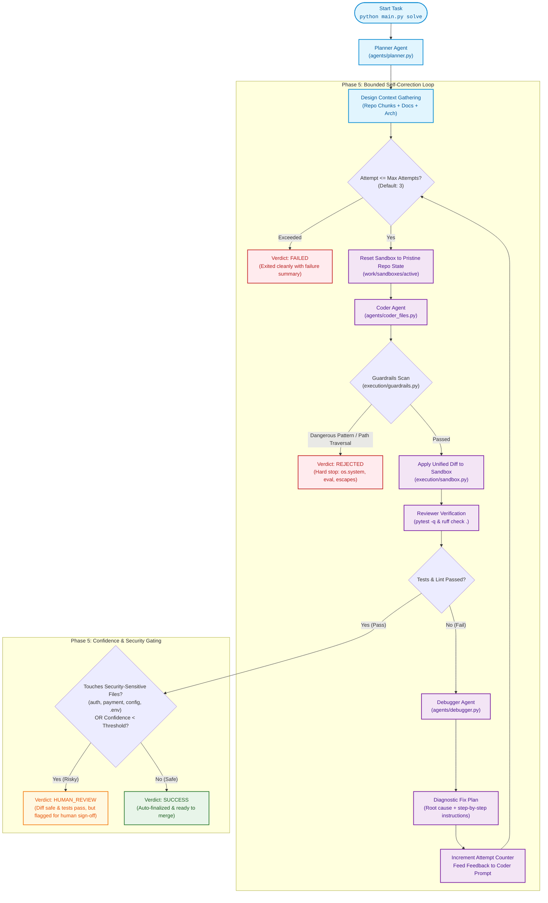

# Phase 5: Debugger Agent, Self-Correction Loop & Confidence Gating

This document provides a comprehensive architectural and operational breakdown of **Phase 5** of the multi-agent AI coding swarm.

---

## Executive Summary

Prior to Phase 5, the swarm executed a linear, one-shot pipeline: **Planner $\rightarrow$ Coder $\rightarrow$ Guardrail Scan $\rightarrow$ Reviewer**. If the Reviewer reported failing tests or linter violations, the process halted immediately with a failure verdict.

**Phase 5 closes the loop and introduces protective gating:**
1. **The Debugger Agent:** Takes raw `pytest` failure traces and `ruff` lint diagnostics alongside the failing unified diff, identifies the root cause, and generates a concrete, step-by-step fix plan for the Coder.
2. **The Self-Correction Loop:** Orchestrates an iterative cycle (`Coder` $\rightarrow$ `Guardrails` $\rightarrow$ `Sandbox Apply` $\rightarrow$ `Reviewer` $\rightarrow$ `Debugger` $\rightarrow$ `Coder`) bounded by an explicit retry cap (`max_attempts: 3–5`) to eliminate infinite loops.
3. **Confidence-Gated Auto-Apply:** Introduces a crucial middle state—`"human_review"`—between `"success"` and `"failed"`. Even when all tests pass with zero warnings, if the diff touches security-sensitive files (`auth`, `payments`, `config`, `.env`) or the Coder's self-reported confidence is below a defined threshold (`< 0.7`), the swarm halts and requests human authorization instead of silently auto-merging.
4. **Sandbox State Rollback:** Resets the temporary sandbox back to the pristine repository baseline before each retry attempt, preventing polluted or hallucinated files from contaminating subsequent attempts.

---

## Architecture Overview



---

## Core Components Deep Dive

### 1. The Debugger Agent (`agents/debugger.py`)

The Debugger is a specialist diagnostic agent called only when the Reviewer reports failure. It does not rewrite code directly; instead, it synthesizes diagnostic information into an actionable fix plan.

#### Inputs:
* **Task Description:** The target objective and acceptance criteria.
* **Reviewer Diagnostic Output:** Raw failure traces from `pytest` and diagnostics from `ruff`.
* **Failed Diff Applied:** The exact diff from the previous attempt, allowing the Debugger to pinpoint precisely which line or file caused the error.

#### System Prompt & Strategy:
```python
DEBUGGER_SYSTEM_PROMPT = (
    "You are the Debugger agent in an AI coding swarm. "
    "Given the task description and failed test or linter output, "
    "identify the exact root cause of the failure and output a concise, "
    "step-by-step fix plan that the Coder agent can implement immediately. "
    "Focus only on the smallest necessary changes to make tests pass."
)
```

The Debugger output is fed directly into the Coder's context for attempt $N+1$:
```text
Debugger Feedback from Attempt 1:
**Root Cause**: The divide function always returns 0.0, failing `assert divide(10, 2) == 5.0`.
**Fix Plan**:
1. Open `math_utils.py`.
2. Replace `return 0.0` with `return float(a) / float(b)`.
3. Add `if b == 0: raise ValueError('Cannot divide by zero')`.
```

---

### 2. The Orchestration Loop (`agents/solve.py`)

The `solve_task` function wires the multi-agent feedback cycle:

```python
def solve_task(task: str, repo: str | Path, *, max_attempts: int = 3, confidence_threshold: float = 0.7, ...) -> SolveResult
```

#### Key Loop Responsibilities:
1. **Bounded Iteration Cap:** The loop runs for a maximum of `max_attempts` (default: 3). If all attempts fail, it terminates cleanly with `status: "failed"`.
2. **Clean Sandbox Reset:**
   ```python
   for attempt in range(1, max_attempts + 1):
       if attempt > 1:
           sandbox = create_sandbox(repo, Path(work_root) / "active")
   ```
   Before each retry, any erroneous files or directories created by a previous failed attempt are cleared by recopying the source repo.
3. **Structured Trace Logging:** Each attempt records an `IterationLog` entry detailing:
   * Attempt number ($1 \dots N$)
   * Coder self-reported confidence ($0.0 \dots 1.0$)
   * Guardrail scan verdict & sensitive flags
   * Reviewer test and lint results
   * Debugger feedback provided

---

### 3. Confidence Gating & Security Sensitivities

Phase 5 prevents autonomous agents from auto-finalizing high-risk changes without human oversight.

#### Gating Criteria:
1. **Security-Sensitive Files:** Checked via `execution/guardrails.py`:
   * Paths containing: `auth`, `authentication`, `payment`, `payments`, `config`, `settings`, `.env`
   * Filenames: `.env`, `config.py`, `settings.py`
2. **Low Model Confidence:**
   * Coder outputs include a `confidence` field ($0.0 \dots 1.0$).
   * If `confidence < confidence_threshold` (default: `0.70`), the run is held for human review even if tests pass.

```python
if last_review.passed:
    if guardrails.security_sensitive:
        return _finalize(
            "human_review",
            attempt,
            coder.confidence,
            True,
            str(sandbox),
            "Review passed but changes touch security-sensitive files; routed to human review.",
            review=last_review,
        )

    if coder.confidence < confidence_threshold:
        return _finalize(
            "human_review",
            attempt,
            coder.confidence,
            False,
            str(sandbox),
            f"Review passed but self-reported confidence ({coder.confidence}) is below threshold ({confidence_threshold}); routed to human review.",
            review=last_review,
        )

    return _finalize("success", ...)
```

---

## Verdict State Machine

Phase 5 introduces a 4-state terminal outcome model:

| Status | Meaning | Next Action |
|---|---|---|
| `success` | Tests & lint passed, diff is safe, and no sensitive files touched. | Clean to merge / apply to base branch. |
| `human_review` | Tests passed, but touches `config`/`auth` or confidence is low. | Pause pipeline; present diff and test report to human operator. |
| `failed` | `max_attempts` exhausted without passing tests/lint. | Escalate failure summary and Debugger diagnostic trace. |
| `rejected` | Guardrail violation (dangerous command, path traversal escape). | Immediate abort; diff discarded. |

---

## Operational Verification

### 1. Automated Test Suite
Phase 5 behaviors are verified using [tests/test_phase5.py](file:///d:/Projects/Swarm%20Agent/tests/test_phase5.py):

```powershell
.venv\Scripts\python.exe -m pytest tests/test_phase5.py -v
```

* `test_solve_self_corrects_with_debugger`: Verifies attempt 1 failure $\rightarrow$ Debugger plan $\rightarrow$ attempt 2 pass.
* `test_solve_security_sensitive_file_routes_to_human_review`: Verifies `config.py` changes trigger `"human_review"`.
* `test_solve_low_confidence_routes_to_human_review`: Verifies confidence below threshold routes to `"human_review"`.
* `test_solve_max_attempts_cap`: Verifies clean exit after max attempts.
* `test_solve_guardrail_rejection`: Verifies unsafe code patterns are blocked.
* `test_solve_passes_failed_diff_to_debugger_and_resets_sandbox`: Verifies diff forwarding and sandbox isolation.

### 2. Live CLI Verification
Execute live tasks against sandboxed test repositories:

```powershell
# Verify Confidence Gating on Sensitive Files (Routes to human_review)
.venv\Scripts\python.exe main.py solve "Add MAX_RETRIES = 5 to config.py and update tests/test_config.py to assert MAX_RETRIES == 5" --repo workspace/test-security --db work/chroma-security

# Verify Self-Correction Loop with Debugger
.venv\Scripts\python.exe main.py solve "Fix the divide function in math_utils.py so tests in test_math_utils.py pass" --repo workspace/test-debugger --db work/chroma-debugger
```
