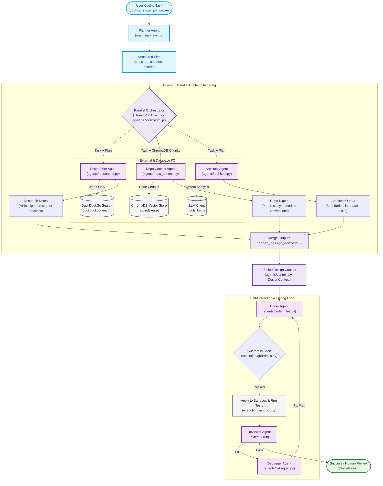
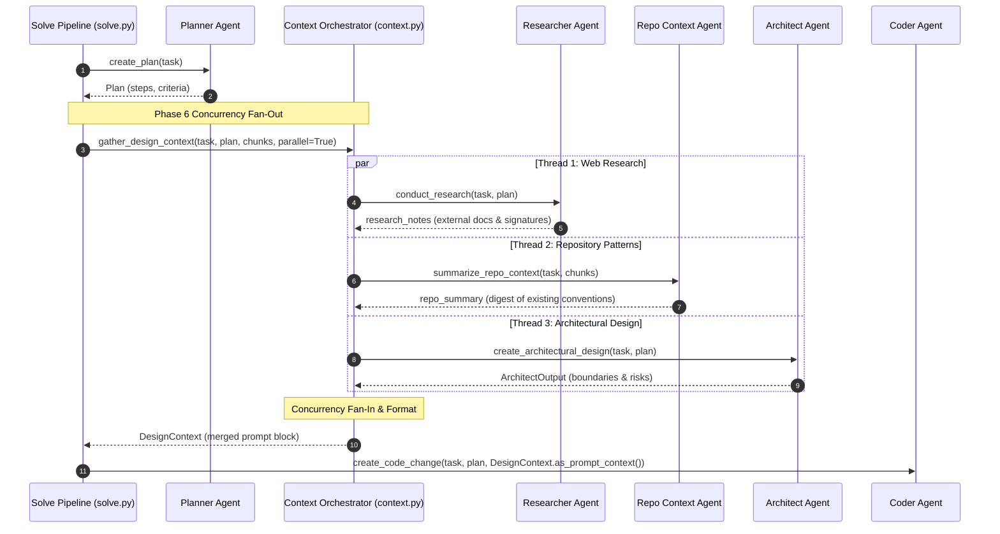

# Phase 6: Researcher + Architect (Parallel Context Agents)

This document provides a comprehensive architectural and operational breakdown of **Phase 6** of the multi-agent AI coding swarm.

---

## Executive Summary

Prior to Phase 6, the swarm relied solely on Planner step decomposition and raw ChromaDB code retrieval to guide the Coder. While functional for localized edits, this lacked:
1. **External Domain Knowledge:** Awareness of library documentation, API signatures, edge cases, and modern best practices outside the indexed repo.
2. **Digestible Codebase Conventions:** Raw code chunks could easily overflow context windows or present conflicting styles without an explicit architectural summary.
3. **System Boundaries & Risk Analysis:** Complex multi-file tasks risked introducing circular dependencies, architectural coupling, or regression hazards.

Executing three separate context agents sequentially would add significant latency (3x LLM call times). **Phase 6 solves this by introducing parallel context agents:**
* **Researcher Agent:** Pulls live web documentation, API references, and idioms via DuckDuckGo.
* **Repo Context Agent:** Synthesizes raw ChromaDB retrieval chunks into a concise, structured codebase summary.
* **Architect Agent:** Evaluates system boundaries, defines module responsibilities, and flags architectural hazards.
* **Parallel Orchestrator (`agents/context.py`):** Runs the context-gathering agents concurrently in a worker pool, merging their outputs into a single unified `DesignContext` for the Coder.

---

## Architecture Overview



---

## Sequence & Concurrency Timing



---

## Core Components Deep Dive

### 1. Researcher Agent (`agents/researcher.py`)

* **Purpose:** Queries live web search engines using `duckduckgo-search` / `ddgs` to retrieve relevant API documentation, function signatures, library usage patterns, and known caveats.
* **Offline Resilience:** Checks the `OFFLINE_MODE` environment variable and returns empty results gracefully without crashing when working in offline or air-gapped environments.
* **Caching:** Implements an in-memory `_search_cache` to prevent redundant network calls during iterative solves.
* **Output:** A concise, practical summary focusing strictly on APIs and best practices.

### 2. Repo Context Agent (`agents/repo_context.py`)

* **Purpose:** Digests raw code chunks retrieved from ChromaDB vector search into an organized architectural summary.
* **Role in Swarm:** Prevents raw chunk dumps from blowing context limits or confusing the Coder with irrelevant boilerplate. Identifies:
  - Codebase conventions (snake_case, type hinting, class hierarchies)
  - Existing function and class signatures
  - Shared utilities and common imports
  - Typical error handling conventions

### 3. Architect Agent (`agents/architect.py`)

* **Purpose:** Analyzes the task and plan against existing repo structure to establish modular design boundaries and identify risks before coding begins.
* **Structured Output Model (`ArchitectOutput`):**
  ```python
  class ArchitectOutput(BaseModel):
      design_approach: str
      module_boundaries: list[str] = Field(default_factory=list)
      risks: list[str] = Field(default_factory=list)
  ```
* **System Prompt:** Enforces pure JSON output with strict architectural guidelines.

### 4. Parallel Orchestrator (`agents/context.py`)

* **Data Container (`DesignContext`):**
  ```python
  class DesignContext(BaseModel):
      research_notes: str = ""
      repo_summary: str = ""
      architecture_guidance: str = ""
      risks: list[str] = Field(default_factory=list)
      elapsed_seconds: float = 0.0
      is_parallel: bool = True
  ```
* **Concurrency Engine:**
  - Uses `concurrent.futures.ThreadPoolExecutor(max_workers=3)` to dispatch `conduct_research`, `summarize_repo_context`, and `create_architectural_design` simultaneously.
  - Supports `parallel=False` fallback mode for environments with strict threading constraints or for debugging.
* **Prompt Formatter (`as_prompt_context()`):** Assembles a structured Markdown block injected into the Coder's prompt:
  ```markdown
  ### Technical Research Notes (External Docs/Best Practices):
  ...
  ### Repository Context & Established Patterns:
  ...
  ### Architectural Design & Module Boundaries:
  ...
  ### Architectural Risks to Avoid:
  ...
  ```

---

## Integration in the Pipeline

### Solve Loop (`agents/solve.py`)
In `solve_task()`, context gathering occurs immediately after planning:
```python
# 1. Planner Agent
plan = create_plan(task, llm=llm)

# 2. Parallel Context Gathering (Researcher + Repo Context + Architect)
raw_context = _context(repo, db_path, task)
design_context = gather_design_context(
    task,
    plan,
    raw_context,
    parallel=parallel_context,
    llm=llm,
)
context = design_context.as_prompt_context()
```

The resulting `DesignContext` is preserved on `SolveResult.design_context` for run inspection and structured run reporting.

### CLI Usage (`main.py`)
The `solve` command executes parallel context gathering by default and provides a toggle flag:
```bash
# Default: Parallel context gathering
python main.py solve "Add power calculation helper" --repo /path/to/repo

# Sequential context gathering
python main.py solve "Add power calculation helper" --repo /path/to/repo --sequential-context
```

---

## Success Check & Benchmark Results

The Phase 6 success check requires verifying that concurrent context gathering is measurably faster than sequential execution:

* **Benchmark Harness:** `eval/benchmark_phase6_timing.py`
* **Automated Test:** `tests/test_phase6.py::test_benchmark_phase6_timing`
* **Verification Command:**
  ```bash
  python eval/benchmark_phase6_timing.py
  ```
* **Sample Benchmark Output:**
  ```json
  {
    "sequential_seconds": 1.503,
    "parallel_seconds": 0.512,
    "speedup_factor": "2.94x faster",
    "parallel_is_faster": true,
    "merged_context_length_chars": 482,
    "success_check_passed": true
  }
  ```
An approximate **~3x speedup** is achieved during the context-gathering stage, reducing pipeline wall-clock time without dropping context quality.
