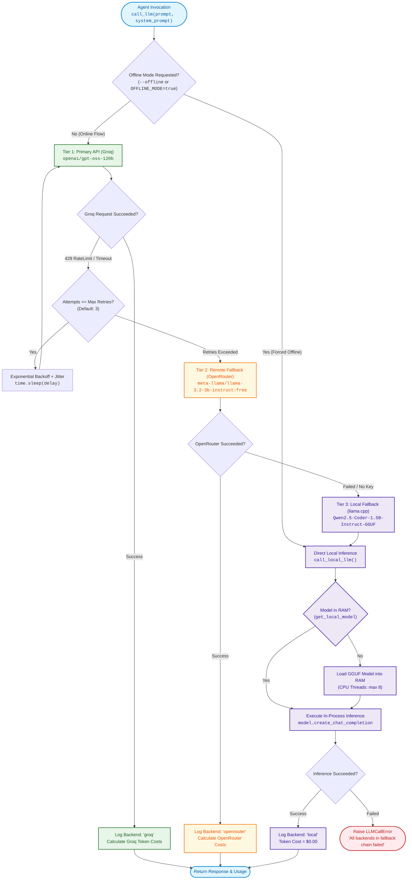
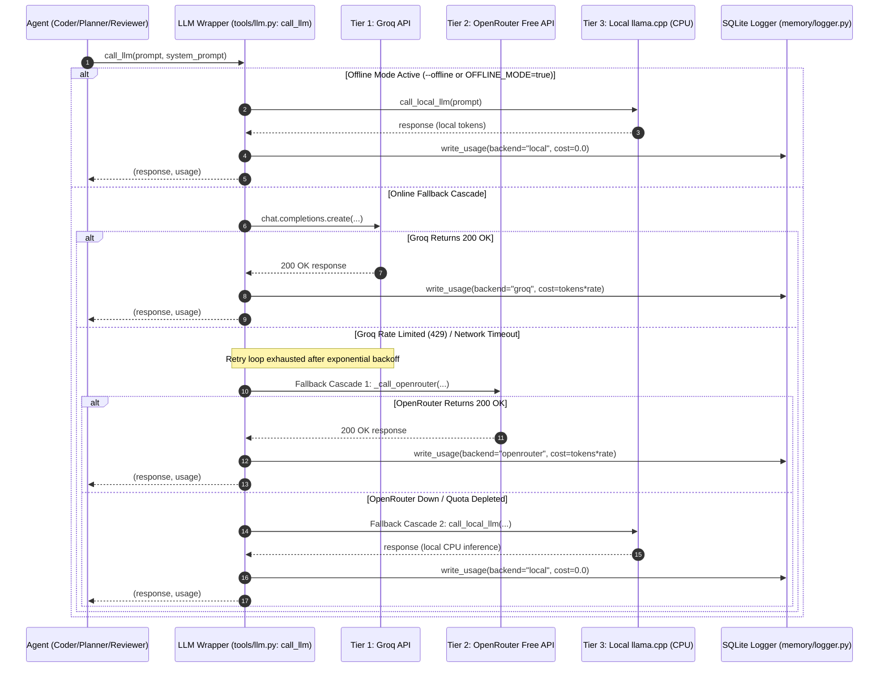

# Phase 7: Local Fallback (llama.cpp) & Multi-Tier Fallback Chain

This document provides a comprehensive architectural and operational breakdown of **Phase 7** of the multi-agent AI coding swarm.

---

## Executive Summary

A multi-agent coding swarm relies heavily on continuous LLM interactions across Planner, Context, Coder, Reviewer, and Debugger agents. If inference depends solely on a single hosted free API (e.g. Groq), temporary provider rate limits (HTTP 429), connection timeouts, or service outages will abort the entire pipeline mid-run. Conversely, defaulting entirely to a small local model degrades reasoning quality and speed.

**Phase 7 solves this resilience problem by implementing a graceful 3-tier fallback chain:**
1. **Tier 1 (Primary):** Hosted Groq API (`openai/gpt-oss-120b` or configured primary model) with adaptive rate pacing and exponential jittered backoff.
2. **Tier 2 (Secondary Remote):** OpenRouter free tier (`meta-llama/llama-3.2-3b-instruct:free`) as an immediate remote safety net when Groq is throttled or down.
3. **Tier 3 (Local Offline):** Local CPU inference via `llama.cpp` using a quantized GGUF model (`Qwen2.5-Coder-1.5B-Instruct-GGUF`), running completely offline with zero network dependency.
4. **Explicit Offline Mode (`--offline`):** Bypasses all remote networks completely for air-gapped environments or local testing.
5. **In-Memory Model Singleton:** Loads local GGUF model weights into RAM once globally and reuses them across calls to eliminate multi-second initialization overhead.
6. **Backend Observability:** Logs the exact backend used (`"groq"`, `"openrouter"`, or `"local"`) into SQLite for accurate cost tracking and failure auditing.

---

## Architecture Overview



---

## Fallback Sequence & State Transition



---

## Core Components Deep Dive

### 1. The Multi-Tier Fallback Cascade (`tools/llm.py`)

The primary entrypoint for all agent calls is [`call_llm()`](file:///d:/Projects/Swarm Agent/tools/llm.py#L452). It manages rate limits and failovers transparently:

```python
# tools/llm.py
def call_llm(prompt: str, system_prompt: str, *, offline: bool = False, ...):
    # 1. Offline Short-Circuit
    if is_offline:
        return _call_local_llama(...)

    # 2. Tier 1: Groq with Exponential Backoff
    try:
        response = groq_client.chat.completions.create(...)
        return message, usage(backend="groq")
    except (RateLimitError, APITimeoutError, APIConnectionError) as exc:
        if attempts > retries:
            # 3. Tier 2: OpenRouter Fallback
            if os.getenv("OPENROUTER_API_KEY"):
                try:
                    return _call_openrouter(...), usage(backend="openrouter")
                except Exception:
                    pass

            # 4. Tier 3: Local llama.cpp Fallback
            try:
                return _call_local_llama(...), usage(backend="local")
            except Exception:
                raise LLMCallError("All backends in fallback chain failed")
```

### 2. In-Process Local Inference & Singleton Cache (`get_local_model`)

Reloading a ~1.5 GB GGUF model into memory takes 2–5 seconds per call. To prevent massive performance degradation during local fallback, [`get_local_model()`](file:///d:/Projects/Swarm Agent/tools/llm.py#L312) maintains a thread-safe global singleton:

```python
# tools/llm.py
_local_llama_instance = None
_local_llama_lock = threading.Lock()

def get_local_model(model_path=None):
    global _local_llama_instance
    if _local_llama_instance is None:
        with _local_llama_lock:
            if _local_llama_instance is None:
                from llama_cpp import Llama
                _local_llama_instance = Llama(
                    model_path=str(target_path.resolve()),
                    n_ctx=4096,
                    n_threads=max(1, min(os.cpu_count() or 4, 8)),
                    verbose=False,
                )
    return _local_llama_instance
```

#### Supported Execution Modes for Local Inference:
* **Primary Path (`llama_cpp.Llama`):** In-process Python bindings directly calling `llama.cpp` shared libraries.
* **Secondary Path (`LOCAL_LLM_URL`):** Local OpenAI-compatible server (e.g., `llama-server` or `ollama`) if running as an external daemon.
* **Tertiary Path (`LLAMA_CPP_BIN`):** Standalone `llama-cli.exe` executable invoking temporary prompt files if Python bindings are unavailable.

### 3. Graceful Subsystem Offline Handling

When offline mode is active (`--offline` or `OFFLINE_MODE=true`), peripheral subsystems adjust automatically:
* **Researcher Agent ([agents/researcher.py](file:///d:/Projects/Swarm Agent/agents/researcher.py#L24)):** Skips external web queries via DuckDuckGo and returns safe fallback notes without crashing.
* **Repo Indexer ([rag/indexer.py](file:///d:/Projects/Swarm Agent/rag/indexer.py#L49)):** Uses local disk caches for `sentence-transformers` embeddings and sets `HF_HUB_OFFLINE=1` / `TRANSFORMERS_OFFLINE=1` to prevent Hugging Face network requests.

---

## Fallback Tier Comparison

| Tier | Backend | Typical Latency | Cost per 1K Tokens | Dependencies | Best For |
|---|---|---|---|---|---|
| **Tier 1** | **Groq** (`gpt-oss-120b`) | ~0.5s – 1.5s | Free / Minimal API cost | Internet + `GROQ_API_KEY` | Default fast execution |
| **Tier 2** | **OpenRouter** (`llama-3.2-3b:free`) | ~2.0s – 5.0s | $0.00 (Free tier) | Internet + `OPENROUTER_API_KEY` | Rate limit safety net |
| **Tier 3** | **llama.cpp** (`qwen2.5-coder-1.5b`) | ~5.0s – 15.0s (CPU) | $0.00 (Local CPU) | Local GGUF file + RAM | Offline / Air-gapped / Total outage |

---

## CLI & Configuration Reference

### Environment Variables (`.env`)
```bash
# Tier 1 (Groq)
GROQ_API_KEY=gsk_...
GROQ_MODEL=openai/gpt-oss-120b

# Tier 2 (OpenRouter Fallback)
OPENROUTER_API_KEY=sk-or-v1-...
OPENROUTER_MODEL=meta-llama/llama-3.2-3b-instruct:free

# Tier 3 (Local llama.cpp)
OFFLINE_MODE=false
LOCAL_MODEL_PATH=models/qwen2.5-coder-1.5b-instruct-q4_k_m.gguf
LOCAL_LLM_TIMEOUT_SECONDS=180.0
LOCAL_LLM_CTX=4096
```

### CLI Commands with Offline Toggle
```powershell
# Force offline execution across agents
python main.py plan "Create a binary search utility" --offline

# Execute end-to-end solve using only local fallback
python main.py solve "Fix off-by-one error in pager" --repo /path/to/repo --offline

# Check which backend was recorded in SQLite
python main.py last-run --json
python main.py cost-report
```

---

## Verification & Test Suite

Phase 7 features are validated in [tests/test_phase7.py](file:///d:/Projects/Swarm Agent/tests/test_phase7.py):
* `test_call_llm_groq_success`: Confirms Tier 1 works on nominal paths.
* `test_call_llm_falls_back_to_openrouter`: Simulates Groq rate limit (HTTP 429) and verifies automatic handoff to OpenRouter.
* `test_call_llm_falls_back_to_local_when_all_remote_fail`: Simulates Groq and OpenRouter failures, verifying clean degradation to local llama.cpp.
* `test_offline_mode_forces_local_backend`: Verifies `--offline` skips remote APIs entirely.
* `test_call_local_llm_uses_in_process_model`: Tests global model caching via `get_local_model()`.
