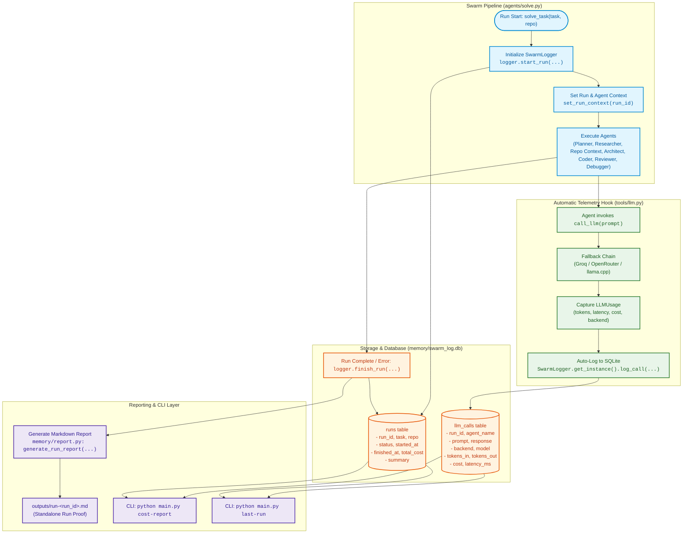
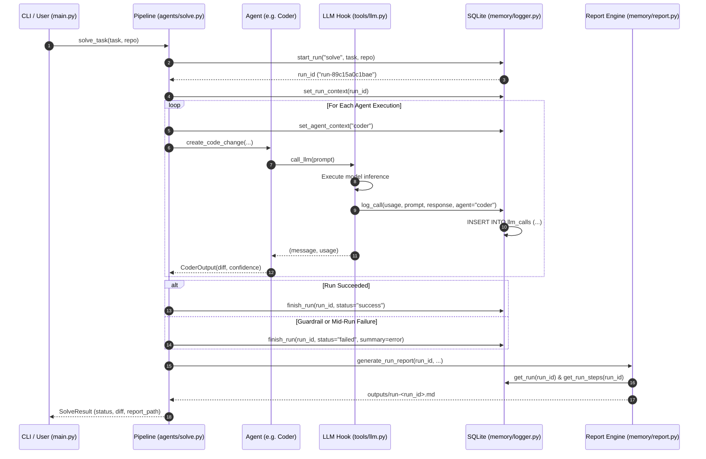
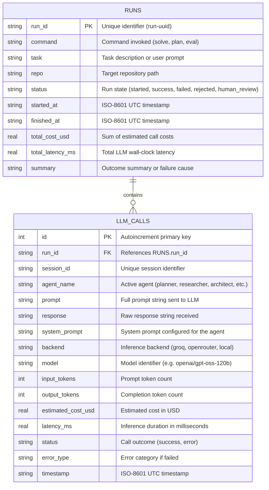

# Phase 8: Logging, Observability & Structured Run Reports

This document provides a comprehensive architectural and operational breakdown of **Phase 8** of the multi-agent AI coding swarm.

---

## Executive Summary

As an autonomous multi-agent system plans, searches, designs, codes, tests, and debugs software across several iterations, understanding what the agents did, why decisions were made, and where failures occurred becomes critical. Bypassing structured logging leaves engineers unable to reconstruct failures, debug hallucinations, or account for LLM token spend.

**Phase 8 makes every swarm run auditable, observable, and reproducible through:**
1. **Persistent SQLite Tracing:** Stores full telemetry across runs (`runs`) and individual LLM invocations (`llm_calls`) including exact prompts, system prompts, responses, token counts, costs, latencies, and backends used.
2. **Context-Aware Auto-Logging:** Intercepts `call_llm()` automatically via `SwarmLogger` and context variables (`current_agent_name`, `current_run_id`), ensuring zero boilerplate inside agent logic.
3. **Structured Run Reports:** Auto-generates standalone Markdown artifacts (`outputs/run-<run_id>.md`) after every `solve` run summarizing task specifications, parallel design context, diffs, test outputs, confidence metrics, and agent timelines.
4. **CLI Observability Surface:**
   - `python main.py cost-report`: Aggregates spend, token consumption, and latency by agent role, backend, and recent runs.
   - `python main.py last-run`: Inspects chronological agent steps from the latest or specified run.
5. **Mid-Run Failure Reconstruction:** Enables reconstructing the exact point, cause, and agent state of any failure without re-running code.

---

## Architecture Overview



---

## Execution & Auto-Logging Sequence



---

## SQLite Database Schema

The SQLite schema is initialized in [`memory/logger.py`](file:///d:/Projects/Swarm Agent/memory/logger.py) (`memory/swarm_log.db`):



---

## Files Used in Phase 8

| File Path | Component | Purpose & Implementation Details |
|---|---|---|
| [`memory/logger.py`](file:///d:/Projects/Swarm%20Agent/memory/logger.py) | **SQLite Schema & Observability Engine** | Contains [`SwarmLogger`](file:///d:/Projects/Swarm%20Agent/memory/logger.py#L39) singleton, tables `runs` and `llm_calls`, thread-safe DB transactions, context variables (`set_run_context`, `set_agent_context`), and queries (`cost_report`, `get_run_steps`, `get_last_run`). |
| [`memory/report.py`](file:///d:/Projects/Swarm%20Agent/memory/report.py) | **Markdown Run Report Generator** | Implements [`generate_run_report()`](file:///d:/Projects/Swarm%20Agent/memory/report.py#L10) to format standalone Markdown summaries (`outputs/run-<run_id>.md`) including task overview, design context, diffs, review outputs, and token breakdowns. |
| [`memory/__init__.py`](file:///d:/Projects/Swarm%20Agent/memory/__init__.py) | **Module Interface** | Exports [`SwarmLogger`](file:///d:/Projects/Swarm%20Agent/memory/logger.py#L39), [`generate_run_report`](file:///d:/Projects/Swarm%20Agent/memory/report.py#L10), and context getters/setters for clean imports. |
| [`tools/llm.py`](file:///d:/Projects/Swarm%20Agent/tools/llm.py) | **Automatic Call Hook** | Intercepts [`call_llm()`](file:///d:/Projects/Swarm%20Agent/tools/llm.py#L452) invocations, reads current agent context, and writes usage entries to `SwarmLogger.get_instance().log_call(...)` with zero agent-side boilerplate. |
| [`main.py`](file:///d:/Projects/Swarm%20Agent/main.py) | **CLI Commands** | Adds `cost-report` (`main.py:96-158`) and `last-run` (`main.py:159-205`) subcommands supporting both human-readable ASCII tables and `--json` export. |
| [`agents/solve.py`](file:///d:/Projects/Swarm%20Agent/agents/solve.py) | **Pipeline Integration** | Initializes `logger.start_run()`, sets agent contexts before agent invocations, and automatically triggers `generate_run_report()` upon task completion or error. |
| [`tests/test_phase8.py`](file:///d:/Projects/Swarm%20Agent/tests/test_phase8.py) | **Test Suite & Success Check** | 8 tests verifying SQLite schema creation, auto-logging hooks, CLI commands, report generation, and the Phase 8 Success Check (mid-run failure reconstruction from logs and report alone). |

---

## Standalone Run Report Format (`outputs/run-<run_id>.md`)

Every `solve` run writes a standalone Markdown artifact structured into 6 sections:

1. **Overview Table:** Run ID, task, repository, final status, start/finish timestamps, total cost, and total latency.
2. **Design Context:** Detailed outputs from parallel context agents:
   - *Technical Research:* Web search findings and library best practices.
   - *Repository Context:* ChromaDB code pattern summarization.
   - *Architecture Guidance:* Proposed module boundaries and flagged risks.
3. **Coder & Iteration History:** Confidence ratings, security-sensitive file checks, guardrail scan status, and debugger iterations.
4. **Final Diff:** Full unified diff patch produced by the Coder agent.
5. **Review & Verification:** Automated test execution output (pytest) and static analysis (ruff).
6. **Execution Trace & Cost Breakdown:** Ordered table of all agent invocations, backends, token counts, and step costs.

---

## CLI Reference & Observability Commands

### 1. Cost & Token Spend Report
```powershell
# Human-readable formatted breakdown
python main.py cost-report

# Raw JSON output for CI or external monitoring
python main.py cost-report --json
```

### 2. Last Run Inspection
```powershell
# Inspect latest run
python main.py last-run

# Inspect specific historical run
python main.py last-run --run-id run-89c15a0c1bae

# Export full step trace (including raw prompts/responses) as JSON
python main.py last-run --json
```

### 3. Direct SQLite Querying
```powershell
# Query directly via Python SQLite
python -c "import sqlite3; conn = sqlite3.connect('memory/swarm_log.db'); print(conn.execute('SELECT run_id, status, total_cost_usd FROM runs ORDER BY id DESC LIMIT 5').fetchall())"
```

---

## Success Check: Mid-Run Failure Reconstruction

The Phase 8 Success Check requires intentionally causing a failure mid-run and reconstructing what happened solely from the SQLite logs and the Markdown report without re-running anything:

1. **Failure Trigger:** When an agent fails mid-run (e.g., Coder crash, guardrail rejection, or invalid syntax), `agents/solve.py` calls `logger.finish_run(run_id, status="failed", summary=error_message)`.
2. **Step Trace Reconstruction:** `python main.py last-run` reveals exactly which agent succeeded before the crash and which agent triggered the error.
3. **Artifact Proof:** The report in `outputs/run-<run_id>.md` documents the exact error message, system state, and audit logs at the point of termination.
4. **Automated Verification:** Validated in `tests/test_phase8.py::test_phase8_failure_reconstruction`.
