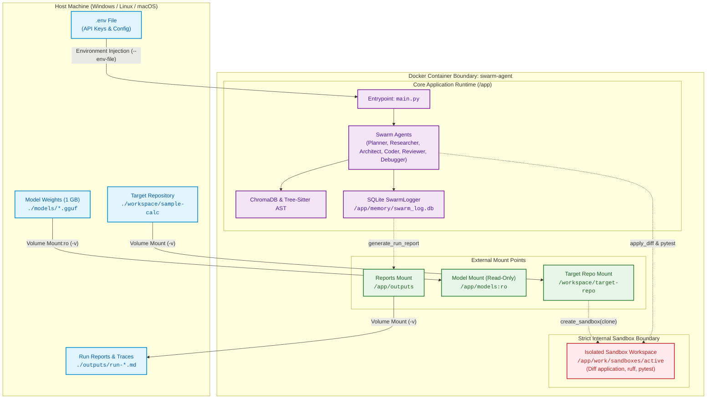

# Phase 9: Docker Containerization & Sandbox Isolation

This document provides a comprehensive architectural and operational breakdown of **Phase 9** of the multi-agent AI coding swarm.

---

## Executive Summary

Prior to Phase 9, running the swarm required a pre-configured local Python virtual environment, specific native C++ compilers for tree-sitter / llama.cpp bindings, and execution of diffs within the host file system. While Phase 4 introduced workspace isolation via temporary directories, executing untrusted, agent-generated code directly on the host machine presents security risks and dependency drift across development environments.

**Phase 9 packages the entire multi-agent swarm into a portable, production-grade Docker container:**
1. **Host-Independent Execution:** Builds a self-contained runtime (`python:3.11-slim`) packaged with all necessary C/C++ compilation toolchains (`build-essential`, `cmake`), `git`, and pre-cached SentenceTransformer embeddings.
2. **Decoupled Volume Mounts:**
   - **Local Models Volume:** The ~1 GB quantized GGUF model (`qwen2.5-coder-1.5b`) is mounted from the host (`/app/models:ro`), keeping Docker image sizes small and builds fast.
   - **Target Repository Volume:** The code repository to be analyzed and modified is mounted into `/workspace/target-repo`.
   - **Reports Volume:** Generated run summaries persist back to host storage in `./outputs`.
3. **Strict Internal Sandboxing:** All diff patching, file modifications, and unit tests execute strictly inside container-internal storage (`/app/work/sandboxes`), completely isolated from the host operating system.
4. **Offline Container Resilience:** SentenceTransformer weights are pre-baked into the image cache, enabling full RAG indexing and offline solves with zero container egress.

---

## Container & Volume Architecture



---

## Sandbox Isolation Boundary

```mermaid
sequenceDiagram
    autonumber
    participant Host as Host File System
    participant Docker as Docker Container (main.py)
    participant Coder as Coder Agent
    participant Guard as Guardrails Scan
    participant SB as Internal Sandbox (/app/work/sandboxes)
    participant Target as Mounted Target Repo (/workspace/target-repo)

    Host->>Docker: docker run -v ./repo:/workspace/target-repo
    Docker->>Target: Inspect and Index source code
    Docker->>SB: create_sandbox(/workspace/target-repo, /app/work/sandboxes/active)
    Note over SB: Fresh, isolated copy created strictly inside container

    Coder->>Guard: Emit unified diff patch
    Guard->>Guard: Reject dangerous syscalls / path traversal
    Guard->>SB: apply_diff(sandbox, patch)
    Note over SB,Target: Mounted target repo is UNTOUCHED; patch applied to internal clone

    Docker->>SB: Run Reviewer (pytest, ruff)
    alt Review & Tests Pass
        SB-->>Docker: Tests succeed
        Docker->>Host: Write summary to /app/outputs (mounted to host ./outputs)
    else Review Fails
        Docker->>Coder: Trigger Debugger loop (max 3 attempts)
    end
```

---

## Directory & Volume Mapping Specification

| Host Path | Container Path | Permissions | Purpose |
|---|---|---|---|
| `./` (build context) | `/app` | Read-Write | Application source code baked into Docker image. |
| `./workspace/sample-calc` | `/workspace/target-repo` | Read-Write | Target code repository for the swarm to analyze and patch. |
| `./models` | `/app/models` | **Read-Only (`:ro`)** | Quantized GGUF model files. Not baked into the image. |
| `./outputs` | `/app/outputs` | Read-Write | Standalone Markdown run reports (`run-*.md`). |
| `./memory` | `/app/memory` | Read-Write | Persistent SQLite execution database (`swarm_log.db`). |
| *None (Container Internal)* | `/app/work/sandboxes` | Internal Only | Sandbox workspace clones where diffs are applied and tested. |

---

## Dockerfile Design Details

The [`Dockerfile`](file:///d:/Projects/Swarm%20Agent/Dockerfile) follows production best practices:
1. **Base Image:** `python:3.11-slim` ensures modern Python features while minimizing vulnerability surface area.
2. **Build Dependencies:** `build-essential`, `cmake`, and `git` are installed for compiling `llama-cpp-python` and native C/C++ tree-sitter grammar parsers, then APT caches are cleaned up.
3. **Embedding Cache Warming:** Runs `SentenceTransformer('all-MiniLM-L6-v2')` at image build time to bake the transformer weights into `/root/.cache/huggingface/`, ensuring that ChromaDB RAG works without internet access.
4. **Environment Defaults:**
   - `SWARM_DB_PATH=/app/memory/swarm_log.db`
   - `SWARM_WORK_ROOT=/app/work/sandboxes`
   - `LOCAL_MODEL_PATH=/app/models/qwen2.5-coder-1.5b-instruct-q4_k_m.gguf`

---

## CLI & Execution Reference

### 1. Build Image
```bash
docker build -t swarm-agent:latest .
```

### 2. Plan a Task
```bash
docker run --rm --env-file .env swarm-agent plan "Add a power function in src/calc.py"
```

### 3. Index a Repository
```bash
docker run --rm --env-file .env \
  -v "${PWD}/workspace/sample-calc:/workspace/target-repo" \
  swarm-agent index --repo /workspace/target-repo
```

### 4. End-to-End Solve
```bash
docker run --rm --env-file .env \
  -v "${PWD}/workspace/sample-calc:/workspace/target-repo" \
  -v "${PWD}/models:/app/models:ro" \
  -v "${PWD}/outputs:/app/outputs" \
  swarm-agent solve "Add a multiply function in src/calc.py" --repo /workspace/target-repo
```

### 5. Offline Solve (Local Fallback Inside Container)
```bash
docker run --rm \
  -v "${PWD}/workspace/sample-calc:/workspace/target-repo" \
  -v "${PWD}/models:/app/models:ro" \
  -v "${PWD}/outputs:/app/outputs" \
  swarm-agent solve "Add a power function in src/calc.py" --repo /workspace/target-repo --offline
```

### 6. Using Docker Compose
```bash
# Run default plan command
docker compose run --rm swarm

# Run full solve
docker compose run --rm swarm solve "Add a power function in src/calc.py" --repo /workspace/target-repo
```

---

## Success Check

The official Phase 9 Success Check is:
> *Run the exact same task on a clean machine (or after deleting your local venv) using only Docker, and get the same result.*

1. Run the `docker run` solve command against `/workspace/target-repo`.
2. Inspect the host's `./outputs/run-<run_id>.md` to verify all 6 agents executed, diffs passed tests, and SQLite logged the complete trace inside the container.
